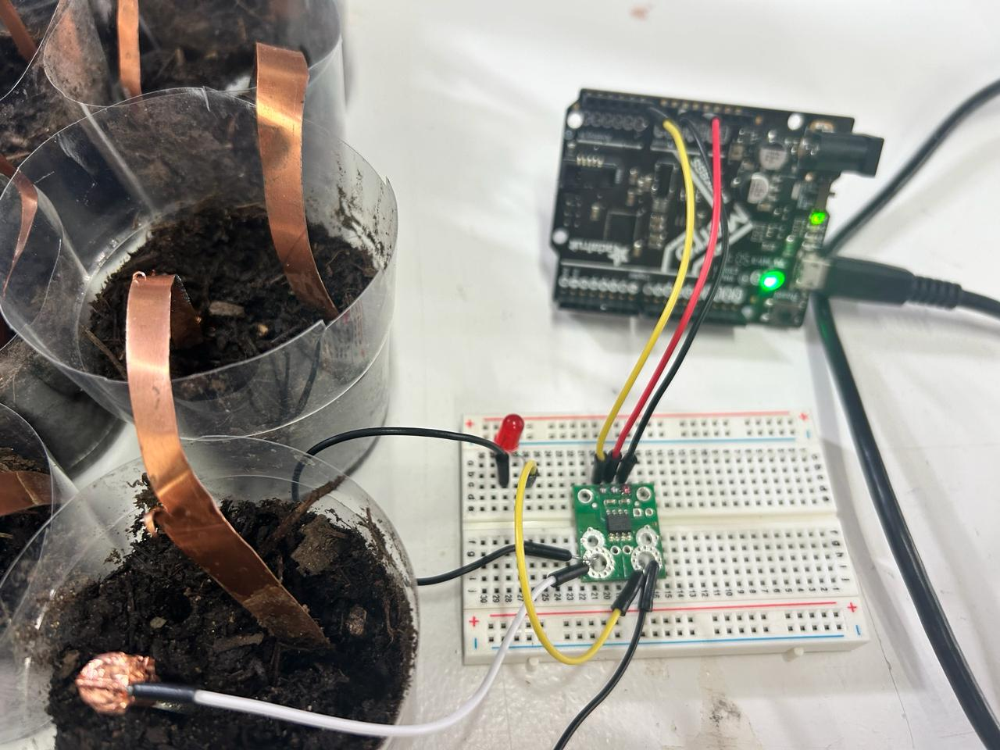

# Micro-Challenge-2

Hello!
Manuja and Flora are back! AKA FLOJA or MANURA :)

We began the second micro challenge with an idea of using a soil battery. We wanted to be able to use the micro-organisms in the soil to conduct electricity, which harnesses the natural electrochemical reactions occurring within the soil to produce electrical energy.

So the idea in simple words - the input is the soil battery, the processor is the intelligence of micro-organisms and artifical intelligence, and the output is a visual 3D printed model created from the fluctuation of current and voltage within the micro-organisms in the soil battery.

Upon experimentation, we found out that there are multiple different variables that affect the conductivity of electricity in a soil battery. The composition of the soil, the moisture content, the temperature, the soil density and compaction and the electrode placement. 

Our experimentation began with normal store bought soil with randomly added moisture to see the fluctuation in the conductivity of the soil. We realized that with more moisture, the soil is able to conduct electricity more efficiently. 

The given objective to follow was to use intelligence as a processor to an input that provides a physical output. We began ideating with multiple different options that could potentially incorporate AI and microorganism intelligence, however we realized that we did not require to use two different intelligences. Our idea that we finalized on was to use the voltage, current and noise fluctuations of the soil battery to see how microorganisms inside soil communicate. 

We connected 16 insulated cups of soil within each other in a series circuit with copper wires and nails, the copper wires were acting as the positive control while the nails were the negative control.

The highest voltage we were able to receive with the soil battery was approximately 12V and it was quite stable. However, with passing time and added fluctuation to the soil conductivity, we reached an unstable voltage of around 5V. We then used a current sensor carrier to add more variables that could change the variables in the x,y,z axis of the model to visually represent how microorganisms ‘communicate’ within each other. 

We did this step by using chatgpt. We gave chatgpt prompts to generate a python code with the values of the voltage, current and noise. With the given python code, we put the code to blender to see how it was able to visually generate a model through the microorganism communication. 

The prompts had to be very specific and required a lot of specificity, in order to generate a model that combines the different variables that we were receiving. 

How did we do it?

Create a soil battery. How to create a soil battery? 

Materials Needed:
1. Two different types of metal electrodes (such as zinc and copper)
2. Soil (moist soil works best)
3. Two wires with alligator clips
4. Voltmeter (optional, for measuring voltage)
5. Container or pot to hold the soil

Steps:
1. Prepare the electrodes: Clean the metal electrodes (e.g., zinc and copper) to remove any dirt or oxidation. You can use sandpaper or a wire brush for this purpose.
2. Insert the electrodes into the soil: Insert the two metal electrodes into the soil, making sure they are at least a few inches apart and do not touch each other. The deeper they are inserted, the better contact they will have with the soil.
3. Connect the wires: Attach one end of each wire to each metal electrode using the alligator clips.
4. Measure voltage: If you have a voltmeter, you can connect it to the free ends of the wires to measure the voltage produced by the soil battery. 
5. Observe and experiment: Over time, the soil battery should generate a small voltage. You can observe the voltage readings and see how they change under different conditions, such as varying the types of soil, the distance between electrodes, or the types of metal used.

 

Connect the soil battery to the current carrier sensor. 
Materials Needed:
1. Soil battery setup (as described earlier)
2. Current sensor carrier (e.g., ACS715)
3. Breadboard
4. Jumper wires
5. Metro Express microcontroller (e.g., Adafruit Metro Express)
6. USB cable for connecting Metro Express to a computer for programming

Steps:
1. Prepare the Soil Battery: Set up your soil battery according to the steps outlined earlier. Ensure that you have the two metal electrodes inserted into the soil and connected to wires with alligator clips.
2. Connect the Soil Battery to the Breadboard:
   - Use jumper wires to connect the wires from the soil battery to the breadboard. 
   - One wire should be connected to the positive rail of the breadboard, and the other wire should be connected to the negative rail.

 

Code to read soil battery current: code found on internet, lost the site but we will find it again

float V;      // Voltage variable
float I;      // Current variable
float Iav;    // Current average variable
float noise;  // Noise variable
int n;        // Counter variable
int R;        // Raw ADC reading variable
int Rav;      // Raw Average ADC reading variable

const int analogInPin = A0;    // Analog input pin connected to the ACS724 output
float voltageReference = 5.0;  // Voltage reference for the Arduino (in volts)
//float sensitivity = 0.066;     // Sensitivity of the ACS724 sensor (mV per A)
float sensitivity = 66;
void setup() {
  Serial.begin(9600);  // Initialize serial communication
}

void loop() {
  for (n = 0; n < 10; n++) {      // Do 10 times over
    V = analogRead(analogInPin);  // Read the voltage on the A0 pin
    R = V;                        // Set R equal to the raw ADC value
    delay(10);

    V = (V / 1023.0) * 5000;  // Convert the digital ADC value to millivolts (5V)
    I = V / sensitivity;      // Convert the sensor voltage reading to Amps
    V = V/1000;
    I = I;
    Serial.print("V = ");
    Serial.print(V);
    Serial.print(" V\t");  // Print voltage
    Serial.print("I = ");
    Serial.print(I);
    Serial.println(" mA");  // Print current

    Iav = Iav + I;  // Sum up the ten current measurements
    Rav = Rav + R;  // Sum up the ten digital ADC measurements

    if (n == 9) {      // If at the tenth measurement, take the average
      Iav = Iav / 10;  // Calculate the average current
      Rav = Rav / 10;  // Calculate the average digital ADC reading

      // Calculate noise (standard deviation)
      noise = 0;
      for (int i = 0; i < 10; i++) {
        V = analogRead(analogInPin);
        R = V;
        delay(10);
        V = (V / 1023.0) * 5000;
        I = V / sensitivity;
        noise += pow(I - Iav, 2);
      }
      noise = sqrt(noise / 10);

      Serial.print("Iav = ");
      Serial.print(Iav);  // Print out the average current value
      Serial.print("\tNoise = ");
      Serial.println(noise);  // Print out the noise value

      Iav = 0;  // Reset the Iav value for the next run
      Rav = 0;  // Reset the Rav value for the next run
      delay(2000);
    }
  }
}

4. Connect the Current Sensor Carrier to the Breadboard:
   - Place the current sensor carrier (e.g., ACS712) on the breadboard.
   - Connect its power pins (VCC and GND) to the respective power rails on the breadboard using jumper wires.
   - Connect the output pin of the current sensor carrier to a free row on the breadboard.
5. Connect the Metro Express Microcontroller:
   - Connect the Metro Express microcontroller to the breadboard using jumper wires.
   - Connect the 5V and GND pins of the Metro Express to the respective power rails on the breadboard.
   - Connect a digital input pin (e.g., pin 13) of the Metro Express to the output pin of the current sensor carrier.
6. Program the Metro Express:
   - Write a program for the Metro Express microcontroller that reads the output of the current sensor carrier and performs any desired actions based on the current readings. You may need to install libraries for interfacing with the current sensor carrier.
   - Upload the program to the Metro Express using the Arduino IDE or CircuitPython.
7. Test the Setup:
   - Power on the Metro Express microcontroller.
   - Monitor the current readings from the soil battery using the current sensor carrier. You can use the serial monitor in your programming environment to view the readings.

Model Image 1.png 

Take the readings from the current carrier sensor and develop a python code - prompting it such that with the readings provided, the model creates changes and varies as the fluctuation in the microorganisms occurs.

